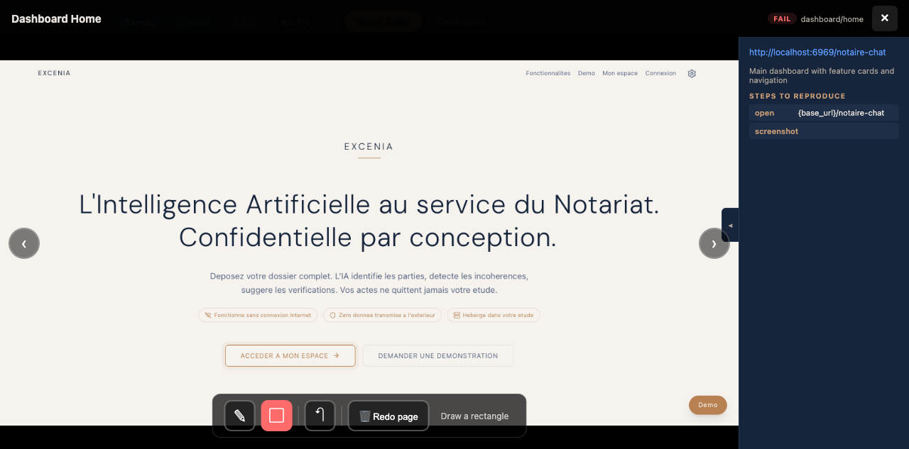

# ShipGuard

**AI-powered code audit + visual E2E testing. Zero tests written.**

You push code. You don't know what you broke. ShipGuard dispatches parallel AI agents to find bugs in your code, then visually verifies the impacted pages with real browser screenshots. No test files to write, no test infrastructure to maintain.

---

## Install

ShipGuard is a Claude Code plugin. Add it in one line:

```
claude plugin add bacoco/shipguard
```

Restart Claude Code. The `/sg-*` commands are ready.

---

## The flow

### Step 1 -- Find the bugs

```
/sg-code-audit
```

Parallel agents scan your codebase zone by zone. Each bug is classified by severity and category. Fixes are applied automatically in isolated git worktrees.


### Step 2 -- Verify visually

```
/sg-visual-run --from-audit
```

The impacted routes from the audit are opened in a real browser. Each page is screenshotted and compared to expected behavior.


### Step 3 -- Review everything in one dashboard

```
/sg-visual-review
```

One page, two tabs: Code Audit (bugs) + Visual Tests (screenshots). Filter by severity, category, status. Search. Export CSV.

### Step 4 -- Annotate and fix

Click any screenshot to open it full-screen. Use the pen tools to circle problems, draw rectangles, or flag a page for redo. Add notes describing what's wrong.



When you're done annotating, click **Validate & Generate Report**. Then run:

```
/sg-visual-fix
```

The AI reads your annotations, traces each problem to the source code, fixes it, and captures before/after screenshots to prove the fix.

---

## Skills

| Skill | What it does |
|-------|-------------|
| `/sg-code-audit` | Dispatch parallel agents to find and fix bugs across your repo |
| `/sg-visual-run` | Run visual tests with agent-browser -- scripted or natural language |
| `/sg-visual-review` | Interactive dashboard -- screenshots + code audit in one page |
| `/sg-visual-discover` | Scan your app and generate YAML test manifests automatically |
| `/sg-visual-fix` | Read annotated screenshots, trace bugs to source, fix and verify |
| `/sg-visual-review-stop` | Stop the review dashboard server |

---

## Code Audit Modes

| Mode | Agents | Rounds | What it finds |
|------|--------|--------|---------------|
| `quick` | 5 | 1 | Known patterns, lint-like issues |
| `standard` | 10 | 1 | Broader coverage, standard audit |
| `deep` | 15 | 2 | + runtime behavior, race conditions |
| `paranoid` | 20 | 3 | + edge cases, security, logic errors |

```
/sg-code-audit paranoid
```

---

## How it works

Tests are YAML manifests that describe what the user sees -- not how the DOM is structured. When a CSS class changes, selector-based tests break. These don't.

1. **Code audit** -- Parallel agents scan your codebase for bugs, grouped by severity
2. **Route mapping** -- Impacted routes are identified from the audit results
3. **Visual testing** -- Real browser sessions screenshot every impacted page
4. **Human review** -- Annotate problems directly on screenshots with pen tools
5. **AI fix** -- The AI reads annotations, traces to source code, fixes, and shows before/after

---

## Proven at scale

112 routes. 16 backend services. 6 authentication flows. Next.js, React, Vue, Angular -- any framework with detectable routes. Handles JWT auth, feature flags, file uploads, multi-step workflows, responsive layouts.

---

## License

MIT
