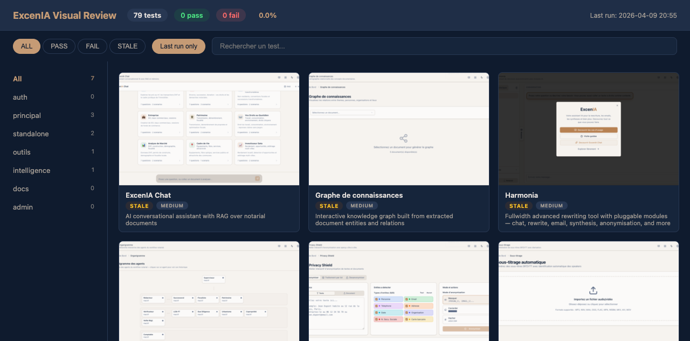
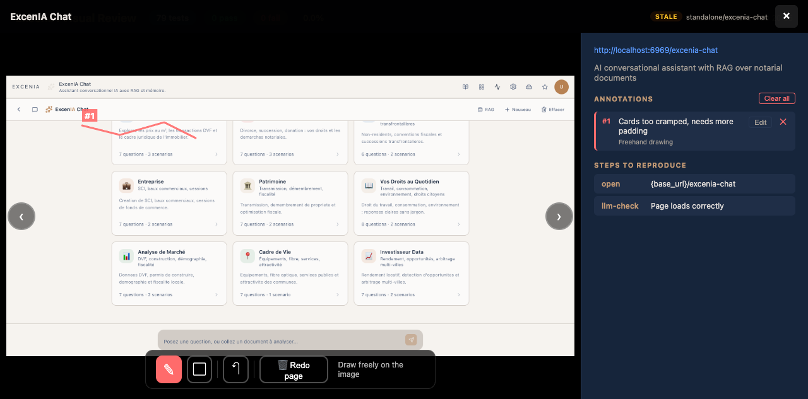
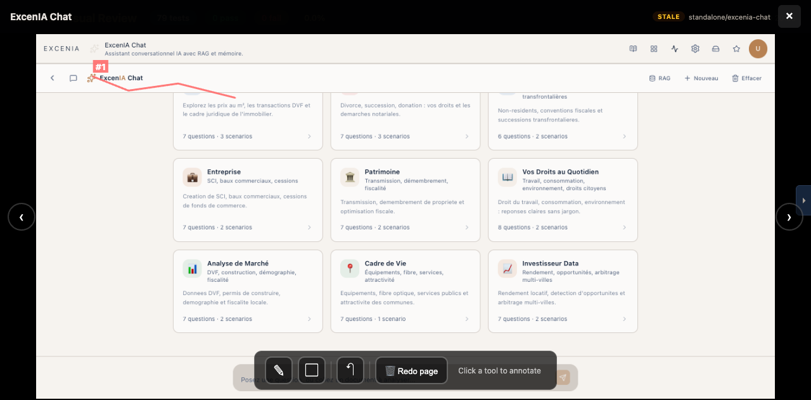

<p align="center">
  
</p>

<p align="center">
  <a href="LICENSE"></a>
  <a href="https://github.com/bacoco/agentic-visual-debugger/releases"></a>
</p>

# agentic-visual-debugger

### Your app ships bugs you never see. This plugin catches them.

One command scans your entire frontend. Another runs every test. A third lets you circle the problems with a pen. A fourth fixes them while you watch.

No Playwright scripts. No Cypress configs. No test code at all.

**Zero test code written by you. Ever.**

---

## Setup

Tell Claude:

> Install the skills from github.com/bacoco/agentic-visual-debugger

Then run `/visual-discover`. Every route in your app now has a test. For a typical Next.js app, that means 80-150 YAML manifests — you wrote nothing.

---

## The Workflow

```
/visual-discover       Scan your code. Generate tests.
      |
/visual-run            Run tests. Capture full-page screenshots.
      |
/visual-review         Review. Annotate problems with a pen.
      |
/visual-fix            AI reads your annotations, fixes the code, shows before/after.
      |
   Repeat              Until zero issues remain.
```

### Discover

`/visual-discover` scans routes, navigation, components, feature flags, and auth flows. Produces YAML manifests in plain language:

```yaml
name: "Upload PDF and verify pipeline"
priority: high
steps:
  - action: open
    url: "{base_url}/documents"
  - action: upload
    target: "file-input"
    file: "{data.pdf_file}"
  - action: llm-check
    criteria: "Entities include: seller, buyer, notary, price"
    screenshot: entities.png
```

No CSS selectors. No brittle XPaths. Tests use **visible text**. When a button label changes, the plugin adapts.


### Run

`/visual-run` runs everything. Or describe what you changed — the plugin figures out which tests to run:

```bash
/visual-run I refactored the upload pipeline
/visual-run I just fixed the prompt-lab React error
/visual-run check the 3 pages I modified today
```

No test exists for what you described? The plugin creates one, runs it, saves it for next time. Every screenshot is full-page and inspected by the AI. Error toast? Blank page? Spinner stuck? Instant FAIL.

Regressions run first. Fixed after 3 consecutive passes? Removed automatically.

### Review

`/visual-review` builds an interactive page at **http://localhost:8888**.



- **Grid** — every test as a card with thumbnail, pass/fail badge, priority
- **Filters** — by status (pass/fail/stale), by category, by name
- **Lightbox** — click any card for the full screenshot + steps to reproduce
- **Annotation pen** — draw red rectangles directly on problems. Each annotation auto-selects the test.



- **Multi-select** — check multiple tests, then export a re-run manifest or a fix manifest with annotation coordinates



### Fix

`/visual-fix` processes your annotations. For each problem you circled:

1. AI reads the screenshot, focuses on your marked region
2. Traces the visual bug to the exact component and line
3. Implements the fix, rebuilds, recaptures the screenshot

The review page regenerates with **before/after comparison**. Still see problems? Annotate, fix again.


---

## All Commands

| Command | What it does |
|---------|-------------|
| `/visual-discover` | Scan codebase, generate test manifests |
| `/visual-run` | Run all tests |
| `/visual-run I changed X` | Run only impacted tests |
| `/visual-review` | Build + open review page |
| `/visual-review-stop` | Stop the server |
| `/visual-fix` | Fix annotated issues, before/after |

---

## What Makes This Different

| Traditional Testing | agentic-visual-debugger |
|--------------------|-------------------|
| You write every test | AI writes every test |
| Tests break when UI changes | Tests adapt to UI changes |
| Screenshots sit in CI artifacts nobody checks | AI reads every screenshot, fails on errors |
| Fixing requires reading test code | Circle the problem, AI traces to source |
| Before/after is a mental exercise | Before/after is a visual comparison page |
| Tests are code you maintain | Tests are YAML you barely touch |

---

## Built for Real Apps

Works with **Next.js, React, Vue, Angular** — any framework with detectable routes. Handles:

- JWT/cookie authentication flows
- Feature-flagged routes
- Multi-step workflows (upload, process, verify)
- LLM-generated content validation
- File uploads
- Responsive layouts

Tested on a production app with **112 routes, 16 services, and 6 authentication flows**.

---

## Product Roadmap

Read the **[Product Readiness PRD](docs/PRD-product-readiness.md)**.

## Development

```bash
git clone https://github.com/bacoco/agentic-visual-debugger.git
cp -r plugins/e2e-agent-browser ~/.claude/plugins/
```

## Contributors

Built by [Loic Baconnier](https://github.com/bacoco) with:
- **Claude Code** (Anthropic) — architecture, skills, review page, annotation system
- **Codex** (OpenAI) — code review, implementation assistance

## License

MIT
