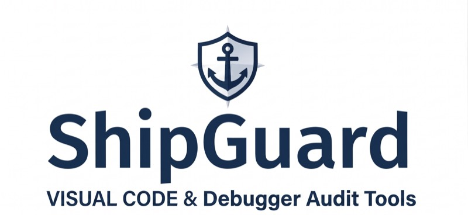
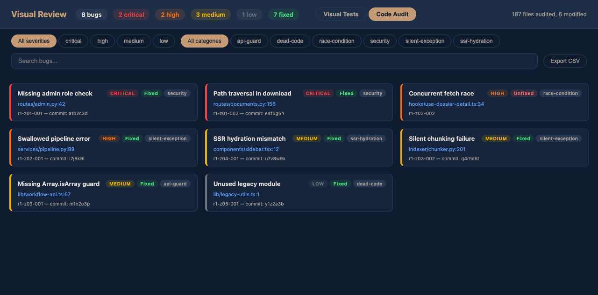
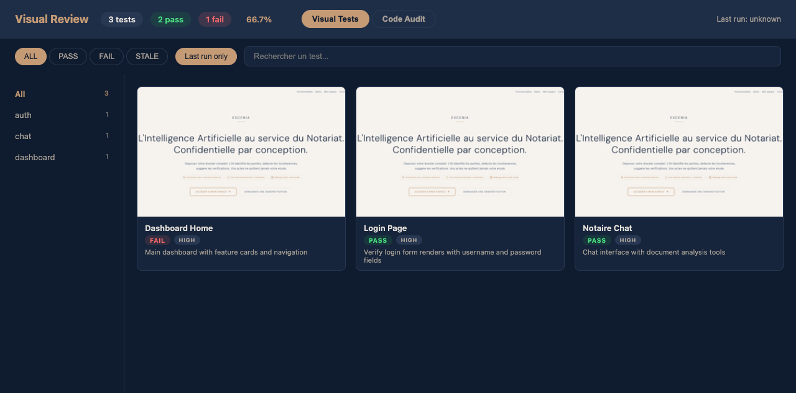
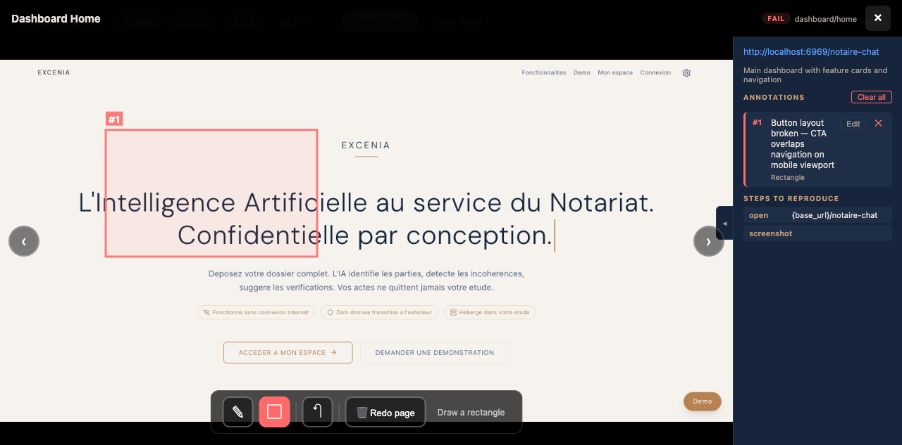

# ShipGuard

**AI-powered code audit + visual E2E testing. Zero tests written.**

You push code. You don't know what you broke. ShipGuard dispatches parallel AI agents to find bugs in your code, then visually verifies the impacted pages with real browser screenshots. No test files to write, no test infrastructure to maintain.

---

## Install

ShipGuard is a Claude Code plugin. Add it in one line:

```
claude plugin add bacoco/shipguard
```

Restart Claude Code. The `/sg-*` commands are ready.

---

## The flow

### Step 1 -- Find the bugs

```
/sg-code-audit
```

Parallel agents scan your codebase zone by zone. Each bug is classified by severity and category. Fixes are applied automatically in isolated git worktrees.



### Step 2 -- Discover what to test

```
/sg-visual-discover
```

Before running any visual test, ShipGuard scans your entire application: routes, pages, navigation tree, auth flows, feature flags. It generates YAML test manifests automatically -- one per user journey. You review the generated manifests, adjust if needed, and you're ready to test.

This is the foundation: without discovery, you don't know what your app looks like. With discovery, you have a complete map of every testable page.

### Step 3 -- Run visual tests

```
/sg-visual-run --from-audit
```

The impacted routes from the audit are opened in a real browser. Each page is screenshotted and compared to expected behavior. You can also run all tests, only regressions, or describe what to test in natural language.



### Step 4 -- Review in the dashboard

```
/sg-visual-review
```

One page, two tabs: Code Audit (bugs) + Visual Tests (screenshots). Filter by severity, category, status. Search. Export CSV.

### Step 5 -- Annotate problems visually

Click any screenshot to open it full-screen. Draw rectangles around broken areas, circle UI problems with the freehand pen, or flag a page for complete redo. Add a text note describing what's wrong.



The annotation is the key: you mark what's broken, in your own words. No need to write code or selectors.

### Step 6 -- Let the AI fix it

```
/sg-visual-fix
```

Click **Validate & Generate Report** in the dashboard. Then run `/sg-visual-fix`. The AI reads every annotation you drew, traces each problem to the exact source file, fixes it, and captures before/after screenshots to prove the fix worked.

---

## Skills

| Skill | What it does |
|-------|-------------|
| `/sg-code-audit` | Dispatch parallel agents to find and fix bugs across your repo |
| `/sg-visual-discover` | Scan your app and generate YAML test manifests automatically |
| `/sg-visual-run` | Run visual tests with agent-browser -- scripted or natural language |
| `/sg-visual-review` | Interactive dashboard -- screenshots + code audit in one page |
| `/sg-visual-fix` | Read annotated screenshots, trace bugs to source, fix and verify |
| `/sg-visual-review-stop` | Stop the review dashboard server |

---

## Code Audit Modes

| Mode | Agents | Rounds | What it finds |
|------|--------|--------|---------------|
| `quick` | 5 | 1 | Known patterns, lint-like issues |
| `standard` | 10 | 1 | Broader coverage, standard audit |
| `deep` | 15 | 2 | + runtime behavior, race conditions |
| `paranoid` | 20 | 3 | + edge cases, security, logic errors |

```
/sg-code-audit paranoid
```

---

## How it works

Tests are YAML manifests that describe what the user sees -- not how the DOM is structured. When a CSS class changes, selector-based tests break. These don't.

1. **Code audit** -- Parallel agents scan your codebase for bugs, grouped by severity
2. **Discovery** -- ShipGuard scans the app and maps every route, page, and user journey
3. **Visual testing** -- Real browser sessions screenshot every impacted page
4. **Human review** -- Annotate problems directly on screenshots with pen tools and notes
5. **AI fix** -- The AI reads annotations, traces to source code, fixes, and shows before/after

---

## Proven at scale

112 routes. 16 backend services. 6 authentication flows. Next.js, React, Vue, Angular -- any framework with detectable routes. Handles JWT auth, feature flags, file uploads, multi-step workflows, responsive layouts.

---

## License

MIT
