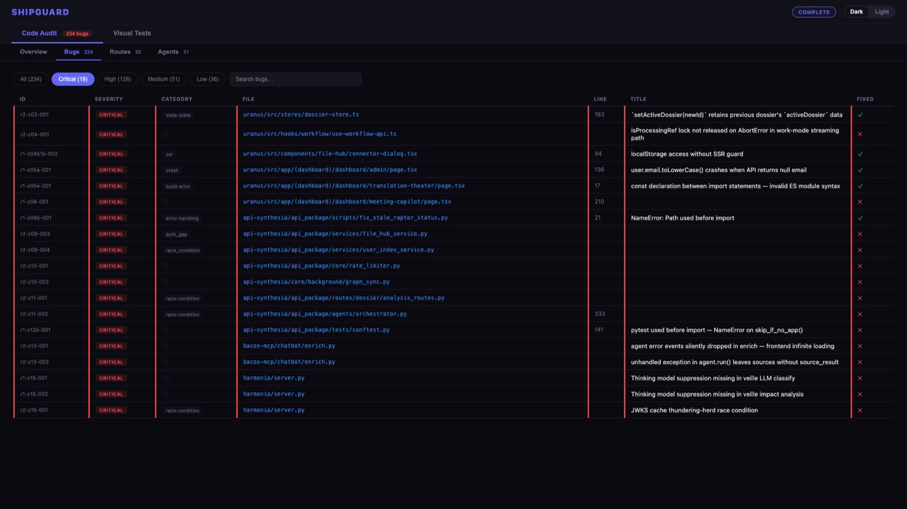
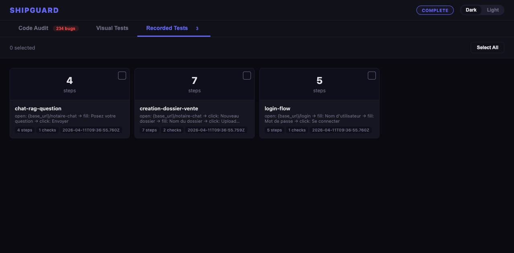
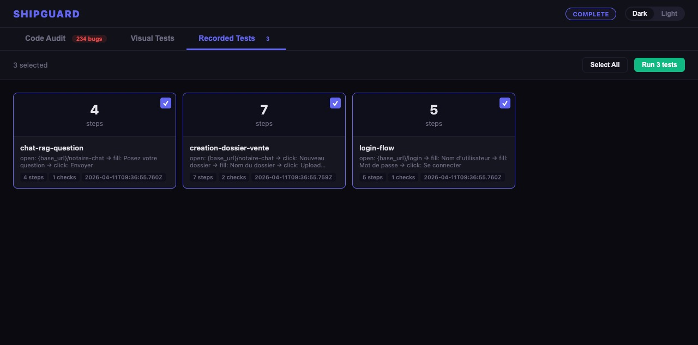
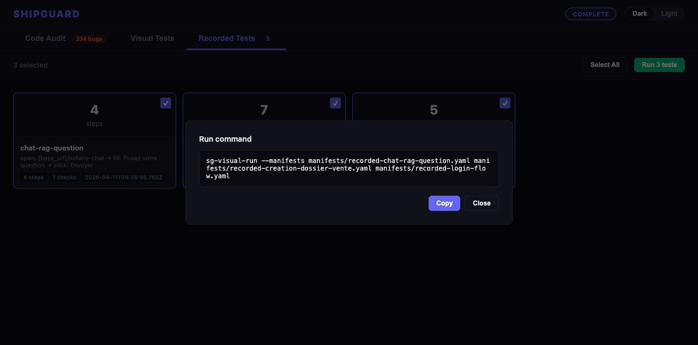

# ShipGuard


**Ship with confidence.** ShipGuard finds bugs before your users do — and gets smarter every time.

## How it works

```
code audit → find bugs → visual test → confirm on screen → human review → annotate → auto-fix → repeat
```

ShipGuard closes the loop between static analysis and visual reality. Code audit finds bugs in source. Visual tests verify if users see them. You annotate what matters. AI fixes it. The system learns and gets better each run.

## Status

| Module | Status | Notes |
|--------|--------|-------|
| Visual E2E Debugger | 🟢 Stable | discover → run → review → fix loop |
| Code Audit | 🟢 Stable | parallel agents, multi-round, verification |
| Macro Recorder | 🟢 Stable | record → replay via YAML manifests |
| Self-Improving Engine | 🟡 Experimental | sg-improve + sg-scout, evolving |
| Review Dashboard | 🟢 Stable | HTML generation, annotations, monitor |
| CI/CD Integration | 🔴 Planned | not yet available |

> ⚠️ Requires **Claude Code** + **agent-browser** plugin environment. Some flows are experimental and evolving fast.

---

Four AI-powered modules. Use one, two, or all four. No test files to write.

<table>
<tr>
<td width="50%" valign="top">

### 📸 Visual E2E Debugger

Auto-discover routes, generate tests, mark bugs on screenshots — **AI traces to source code and fixes automatically**.

```
/sg-visual-run
```

</td>
<td width="50%" valign="top">

### 🔍 Code Audit

Parallel AI agents scan your entire codebase, find bugs, and **fix them automatically**. Race conditions, auth gaps, silent exceptions, resource leaks.

```
/sg-code-audit
```

</td>
</tr>
<tr>
<td width="50%" valign="top">

### 🎬 Macro Recorder

Record your browser interactions and **turn them into replayable tests**. Like Excel's macro recorder, but for visual testing.

```
/sg-record http://localhost:3000
```

</td>
<td width="50%" valign="top">

### 🧠 Self-Improving Engine

ShipGuard **learns from every run** and gets smarter. Scouts GitHub for new techniques. Each audit is better than the last.

```
/sg-improve
```

</td>
</tr>
</table>

### Install

```bash
claude plugin add bacoco/shipguard
npm install -g agent-browser && agent-browser install --with-deps
```

 

> ⚠️ **Token Usage** — Code audits are token-intensive. `standard` (10 agents) ≈ 2M tokens. `deep` (15 agents, 2 rounds) ≈ 5M+. `paranoid` (20 agents, 3 rounds) can exceed 10M.

---

## Visual E2E Debugger

Mark bugs directly on screenshots. The AI traces each annotation to source code and fixes it.


```bash
/sg-visual-run I changed the sidebar
```

### Commands

| Command | What it does |
|---------|-------------|
| `/sg-visual-discover` | Scan codebase, generate YAML test manifests per route |
| `/sg-visual-run [what]` | Execute manifests — natural language or flags |
| `/sg-visual-review` | Launch interactive screenshot review dashboard |
| `/sg-visual-fix` | Auto-fix bugs annotated in the review dashboard |
| `/sg-visual-review-stop` | Stop the review server |

### Smart Annotations (Gemini-style)

The review dashboard uses **draggable annotation cards** to mark visual bugs on screenshots. Click anywhere on a screenshot to place a pin, then describe the problem.

**How it works:**
1. Open a screenshot in the lightbox
2. **Double-click** anywhere on the image — a pin appears instantly (or click **+ Add Note** first)
3. **Click** = point pin. **Drag** = rectangle zone selection (highlights the problem area)
4. Choose severity + type your note → a card appears connected to the pin
5. **Drag the pin** to reposition — zone, card, and leader line all move together
6. **Drag the card** separately to reposition just the label
7. **Double-click** a card to edit text/severity, click X to delete
8. Click **Validate & Generate Report** when done → produces `fix-manifest.json` with zone coordinates
9. Run `/sg-visual-fix` → AI reads your annotations + zone coords, traces to source code, fixes automatically

**Severity colors:**

| Color | Level | When to use |
|-------|-------|-------------|
| 🔴 Red | **Critical** | Broken layout, missing content, crash |
| 🟠 Orange | **High** | Wrong alignment, color mismatch, bad spacing |
| 🔵 Blue | **Medium** | Minor visual inconsistency, polish needed |
| ⚪ Gray | **Info** | Suggestion, not a bug |


### sg-visual-run options

```bash
/sg-visual-run                                  # Interactive — choose scope
/sg-visual-run I changed the sidebar, check it  # Natural language
/sg-visual-run --from-audit                     # Test audit-impacted routes
/sg-visual-run --regressions                    # Re-run previously failed tests
/sg-visual-run --all                            # Full suite
```

`--from-audit` reads `impacted_ui_routes` (or legacy `impacted_routes`) from `audit-results.json` — a natural bridge between Code Audit and Visual Debugger.

### Discover options

```bash
/sg-visual-discover                    # Current project
/sg-visual-discover --all              # Full discovery
/sg-visual-discover --refresh-existing # Regenerate existing manifests
```

Supports Next.js (App Router & Pages Router), React Router, Vue, Angular.

---

## Macro Recorder

Record what you do in the browser and turn it into a replayable test. Like Excel's macro recorder, but for visual testing.



```bash
/sg-record http://localhost:3000/dashboard --name my-test
```

### How it works

1. **Launch** — Opens a Playwright browser with a floating toolbar
2. **Navigate** — Browse your app normally. Clicks, inputs, uploads are captured automatically
3. **Check** — Click the Check button, then click an element to mark it as an assertion
4. **Undo / Delete / Pause** — Fix mistakes without restarting
5. **Stop** — Saves a YAML manifest ready for `/sg-visual-run`

### Test Library

Recorded tests appear as cards in the review dashboard under the **Recorded Tests** tab.



Select the tests you want to run, click **Run** — the command is ready to copy.



### Two ways to create tests

| | `/sg-visual-discover` | `/sg-record` |
|---|---|---|
| **Source** | AI scans your code | Human records interactions |
| **When** | After code changes | After manual QA, bug reproduction, new feature walkthrough |
| **Output** | Same YAML format | Same YAML format |

Both feed into the same pipeline: `sg-visual-run` executes them, `sg-visual-review` shows results, `sg-visual-fix` fixes failures.

### Options

```bash
/sg-record http://localhost:3000                              # Interactive — asks for name on stop
/sg-record http://localhost:3000 --name login-flow            # Preset name
/sg-record http://localhost:3000 --storage auth.json          # Skip login (reuse saved auth)
/sg-record http://localhost:3000 --save-storage auth.json     # Save auth for future recordings
```

---

## Code Audit

Dispatch parallel AI agents to audit your entire codebase. Each agent reviews a non-overlapping zone, finds bugs, fixes them, and produces structured JSON. Watch progress in real-time on the Mission Control dashboard.

```bash
/sg-code-audit deep
```

### Modes

| Mode | Agents | Rounds | Coverage |
|------|--------|--------|----------|
| quick | 5 | 1 | Surface scan |
| standard | 10 | 1 | Full codebase (default) |
| deep | 15 | 2 | Surface + runtime behavior |
| paranoid | 20 | 3 | Surface + runtime + edge cases & security |

### Multi-round depth

- **R1** — Null refs, missing guards, type mismatches
- **R2** — Race conditions, async pitfalls, state management
- **R3** — Edge cases, injection, auth bypass, data leaks

### Model Configuration

By default, `auto` mode uses Haiku for R1 (fast surface scan) and **Opus 4.7 for R2/R3** (deep bug hunt — the +8 points SWE-bench Verified gap over Sonnet 4.6 translates to real cross-file bugs caught). Override with `--model` to control which model runs all rounds:

| Flag | Behavior |
|------|----------|
| `--model=auto` | Haiku for R1, **Opus** for R2/R3 (default) — depth where it matters |
| `--model=haiku` | Haiku everywhere — fast triage, more noise |
| `--model=sonnet` | Sonnet everywhere — balanced, use when Opus weekly quota is saturated |
| `--model=opus` | Opus everywhere — maximum depth (R1 too), highest token cost |

```bash
/sg-code-audit deep --model=opus          # Critical audit with maximum depth (R1 too)
/sg-code-audit --model=haiku --all        # Quick full-repo sweep, minimal cost
/sg-code-audit --model=sonnet             # Run when Opus weekly cap is tight
/sg-code-audit deep --model=opus --focus=src/auth/  # Max rigor on auth code
```

**Why R2/R3 uses Opus by default:** Surface pattern scans (R1) are bulk work — Haiku handles them fine. Deep/paranoid rounds hunt subtle cross-file and logic bugs, where Opus 4.7's reasoning advantage turns into real findings. Anthropic's benchmarks show Opus 4.7 at 87.6% SWE-bench Verified vs 79.6% for Sonnet 4.6.

### Smart Scope

By default, ShipGuard detects what changed and asks whether to limit the audit:

```
/sg-code-audit       # "12 files changed since main. Audit only what changed?"
```

Override with flags:

| Flag | Effect |
|------|--------|
| `--all` | Force full scope, skip the question |
| `--diff=<ref>` | Use a specific base reference |
| `--focus=path/` | Restrict to a directory |
| `--report-only` | Find bugs but do not fix them |
| `--model=<model>` | Override model strategy (see above) |

Flags combine freely: `/sg-code-audit deep --focus=src/ --report-only --model=opus`

### Live Dashboard

At startup, the audit offers to open the Mission Control dashboard. The **Code Audit** tab shows real-time agent pods (running/done/pending), severity heatmap, bug table filterable by severity and free-text search. Polls every 3s during active audit.


### Finding Verification

After zone agents return findings, ShipGuard independently verifies each critical/high bug is real — not a hallucination.

**Two-stage filter:**

1. **Constitutional pre-filter (zero LLM cost)** — checks the cited file exists, line number is in range, bug ID format is valid. Catches obvious hallucinations instantly.
2. **Haiku verification agents** — one agent per finding, all dispatched in parallel. Each reads the actual file:line and scores 0-100.

| Score | Verdict | Action |
|-------|---------|--------|
| 80-100 | Confirmed | Kept as-is |
| 40-79 | Uncertain | Severity downgraded (critical→high, high→medium) |
| 0-39 | Rejected | Moved to `unverified_bugs` (kept for audit trail) |

Cuts false positives ~15-30%. Medium/low findings skip verification (too cheap to be worth it).

### Risk Score

A single 0-100 number representing codebase risk. Uses geometric weighting — many low-severity findings can't inflate past the worst single finding:

```
1st finding:  100% of base points (critical=25, high=15, medium=5, low=1)
2nd finding:   50%
3rd finding:   25%
4th finding:   12.5%  ...and so on
```

| Score | Risk level |
|-------|-----------|
| 0-15 | Low — mostly clean |
| 16-35 | Moderate — some real issues |
| 36-60 | High — significant bugs |
| 61-100 | Critical — severe issues |

### Output

Results are written to two formats:

**`audit-results.json`** (canonical):
- `summary` — totals by severity, category, and `risk_score` (0-100)
- `verification` — how many findings were checked, confirmed, uncertain, rejected
- `bugs[]` — file, line, severity, description, fix status, `verification_score`, `verified`
- `unverified_bugs[]` — findings rejected by verification (score < 40)
- `impacted_ui_routes[]` — UI routes affected (consumed by `/sg-visual-run --from-audit`)
- `impacted_backend[]` — API endpoints/services affected (reported in dashboard)

**`audit-results.toon`** (compact, ~40% fewer tokens):
```
# bugs[107]{id,severity,category,file,line,title,verified,score}:
r1-z01-001,high,logic-error,src/components/foo.tsx,71,key={index} on list,true,95
r1-z01-002,medium,error-handling,routes/chat.py,142,bare except,uncertain,55
```

Header-once + CSV-rows encoding. Used by `sg-improve` for cheaper LLM analysis.

### Supported languages

Python, TypeScript/React, Next.js, Infrastructure (Docker/YAML/CI), Go, Rust, JVM.

---

## Self-Improving Engine

The other three modules find bugs, test UI, and record flows. This module makes them **get better over time**.

No ML model. No fine-tuning. Just structured memory and adaptive prompts — each run accumulates knowledge that the next run uses automatically.

### `/sg-improve` — Learn from sessions

After each audit or test session, extract what worked and what didn't.

```bash
/sg-improve              # Full loop — local learnings + GitHub issue
/sg-improve --local-only # Save learnings locally, skip GitHub
/sg-improve --dry-run    # Preview what would be saved
/sg-improve --rollback   # Undo the last sg-improve (safety net)
/sg-improve --history    # List all snapshots
```

**What gets learned:**

| Learning | Example | Used by |
|----------|---------|---------|
| Zone sizing | "hooks/ needs max 80 files per zone" | Code Audit zone discovery |
| Bug patterns | "`.first()` without None guard → critical" | Agent checklist injection |
| Noise filters | "f-string loggers → batch into single entry" | Agent prompt |
| Infra timing | "api-synthesia needs 4 min to start" | Post-audit rebuild |
| Success patterns | "worktree isolation works — don't change" | What NOT to touch |
| Coding mistakes | `mistakes.md` — error journal read at every session | All development |

**User friction detection:** sg-improve also scans user messages for correction/frustration signals:

| Signal | Pattern | Priority |
|--------|---------|----------|
| Command failure | Tool exit code != 0 | 100 |
| User correction | "I said", "that's wrong", "pas ca" | 80 |
| Redo request | "refais", "try again", "relance" | 70 |
| Repetition | Same instruction 2+ times (Jaccard > 0.5) | 60 |
| Tone escalation | 3+ uppercase words, 2+ exclamation marks | 40 |

These signals feed into learnings alongside the structured audit data.

**The reinforcement loop:**

```
Run 1: hooks/ overflows at 172 files → sg-improve saves max_files: 80
Run 2: sg-code-audit reads the hint → splits into 2 zones → no overflow ✓

Run 1: .first() crashes found 5 times → sg-improve saves audit_hint
Run 2: agents see the pattern in their checklist → catch it on first scan ✓
```

**Built-in safety:** Every `/sg-improve` run takes a snapshot before modifying anything. If the changes make things worse, `/sg-improve --rollback` restores the previous state instantly.

### `/sg-scout` — Learn from the ecosystem

Scan GitHub for techniques that could make ShipGuard better.

```bash
/sg-scout                                # Full scan — find relevant repos
/sg-scout https://github.com/owner/repo  # Deep-dive on one repo
/sg-scout --topic=self-improving         # Focus on auto-optimization
```

Each technique is scored on **impact, novelty, applicability, and effort**. High-scoring ideas become GitHub issues on `bacoco/ShipGuard`. All findings accumulate in `docs/scout-reports/techniques-library.md`.

**Two feedback paths:**

| Path | What flows | Who benefits |
|------|-----------|--------------|
| **Local** (`.shipguard/`) | Zone hints, patterns, noise filters, mistakes | Your project |
| **Upstream** (GitHub issues) | Generic improvements, techniques | Everyone using ShipGuard |

Inspired by [eval-robuste](https://github.com/Alexmacapple/alex-claude-skill/tree/main/eval-robuste) and [self-improving-agent-skills](https://github.com/Shubhamsaboo/awesome-llm-apps/tree/main/awesome_agent_skills/self-improving-agent-skills).

---

## Compatibility

Built for **Claude Code**. Partial support for other AI CLIs:

| Feature | Claude Code | Codex CLI / Gemini CLI |
|---------|------------|----------------------|
| Code Audit (parallel) | ✅ Full | ❌ Requires Agent tool |
| Visual E2E Debugger | ✅ Full | ✅ agent-browser is CLI-independent |
| Macro Recorder | ✅ Full | ✅ Playwright is CLI-independent |
| Review Dashboard | ✅ Full | ✅ Pure Node.js |
| Visual Discover/Fix | ✅ Full | ✅ Bash + LLM prompts |
| Self-Improving Engine | ✅ Full | ✅ gh CLI is universal |

The visual testing pipeline works with any AI CLI that can run shell commands and read/write files. Code audit parallelization requires Claude Code's `Agent` tool with worktree isolation.

Community adapters welcome.

---

## Quick Start

```bash
# Install
claude plugin add bacoco/shipguard
npm install -g agent-browser && agent-browser install --with-deps

# Audit your code
/sg-code-audit

# Record a test manually
/sg-record http://localhost:3000

# Run all tests
/sg-visual-run

# Learn from the session
/sg-improve
```

## Configuration

Create `visual-tests/_config.yaml`:

```yaml
base_url: "http://localhost:3000"
credentials:
  username: "testuser"
  password: "testpass"
build_command: "docker compose up -d --build frontend"  # optional
```

## License

MIT
